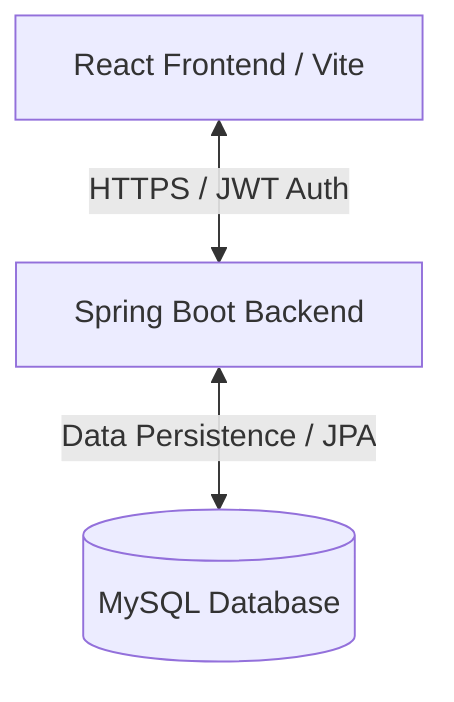

# SubGuard

A high-performance Spring Boot and React application designed to help users track subscriptions, save money, and manage digital privacy from a single unified dashboard.

---

## Previews
The user interface features a modern, responsive glassmorphic layout built with React. Below is a high-level preview of the core application screens:

**Landing**


**Dashboard**


**Subscription Management**


---

## Project Overview
SubGuard is a smart subscription and privacy manager. It aggregates fragmented digital accounts, subscriptions, and local vault records into a clean, centralized workspace. Instead of manually tracking renewals on spreadsheets or missing trial expiration dates, SubGuard programmatically organizes these events and provides timely notifications.

---

## Problem Statement
Modern digital consumers suffer from subscription fatigue. Individuals often subscribe to multiple services (Netflix, Spotify, SaaS tools) and forget renewals, leading to unwanted charges. Additionally, managing linked personal accounts across various platforms is time-consuming and prone to privacy leaks. SubGuard solves this problem by providing a simple, automated, and secure platform to monitor digital spending and active accounts in real-time.

---

## Core Features

### 🔄 Subscription Tracker
Track service names, costs, and exact renewal dates. The system aggregates this data to visualize monthly spending and identify overlapping services.

### 🔗 Linked Account Monitoring
Keep a tight leash on digital privacy by tracking which email accounts are linked to which services. Stop guessing your login credentials and identify unused accounts quickly.

### 🔐 Secure Authentication & Vault
A fully integrated, stateless Spring Security JWT authentication layer ensures your financial and digital records remain strictly private.

---

## Technology Stack
The platform is constructed with a modern, high-performance tech stack:
* **Backend Framework:** Spring Boot (Java) for robust REST API processing.
* **Security:** Spring Security configured for stateless JWT authentication.
* **Database:** MySQL relational database.
* **Frontend Web Application:** React with Vite, styled with modern CSS variables for dynamic Light/Dark mode glassmorphism.

---

## System Architecture
SubGuard utilizes a decoupled architecture segregating the React client from the Spring Boot data pipelines.



---

## Running the Project Locally

The easiest and recommended way to run the project is using Docker.

### 1. Clone the repository
```bash
git clone https://github.com/Fuionic/SubGuard.git
cd SubGuard
```

### 2. Configure Environment Variables
Create the  environment file and update it with your desired database credentials:


### 3. Run with Docker Compose
```bash
docker-compose up -d --build
```
This will automatically:
- Start a MySQL database and configure it with your credentials.
- Build and start the Spring Boot backend on port `8080`.
- Build and serve the React frontend on port `3000`.

You can now access the application at `http://localhost:3000`.

---

## API Endpoints Overview
The backend exposes comprehensive REST endpoints (tested via Postman):

**Authentication**
- `POST /auth/signup` → Register new user
- `POST /auth/login` → User login & JWT issuance

**Subscription Management**
- `POST /subscription` → Add new subscription
- `GET /subscriptions` → Retrieve all subscriptions

**Linked Accounts**
- `POST /linked-account` → Add a linked account
- `GET /linked-accounts` → Retrieve all linked accounts

---

## Future Scope
Planned features include:
* **Privacy Cleaner:** Identify unused accounts and suggest cleanup actions.
* **Warranty & Bill Vault:** Store receipts and track physical product warranty expiry.
* **Smart Analytics:** Monitor spending velocity and suggest cheaper subscription alternatives.

---
