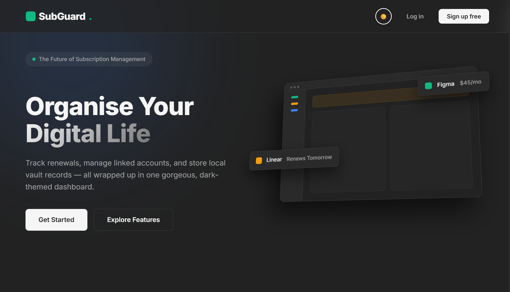
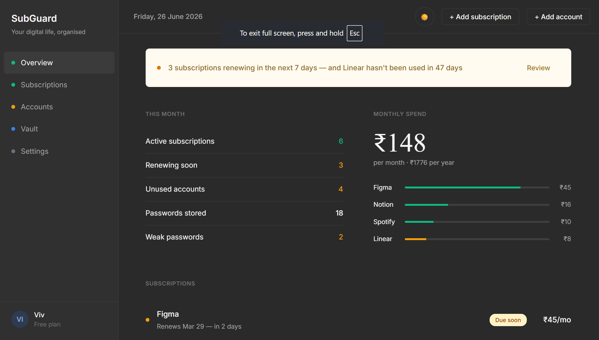
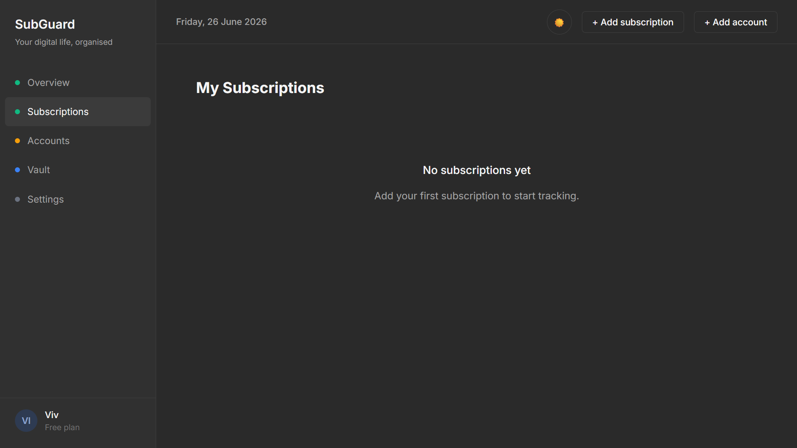
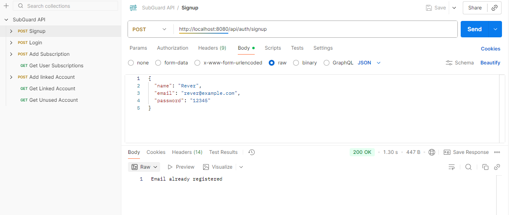
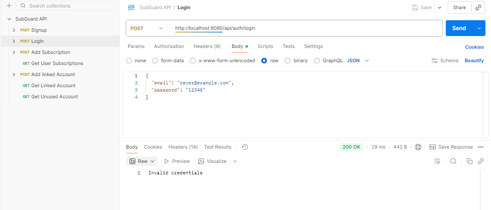
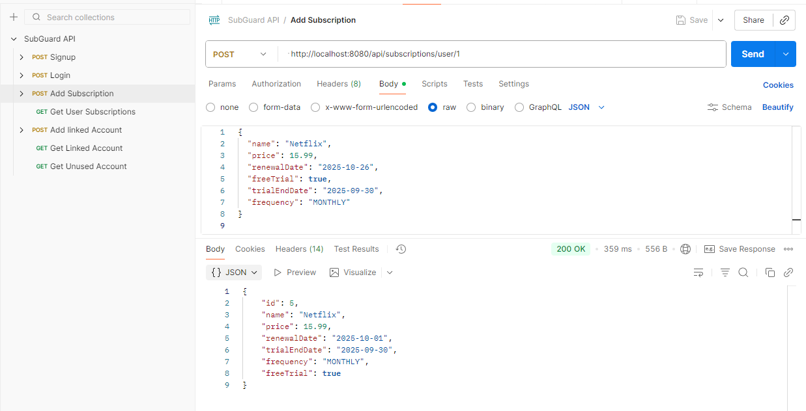
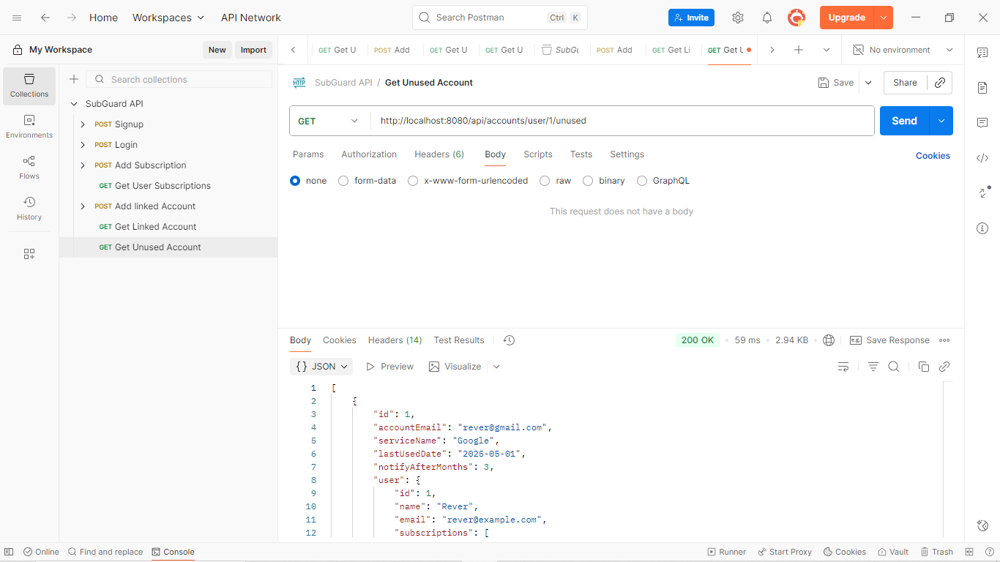
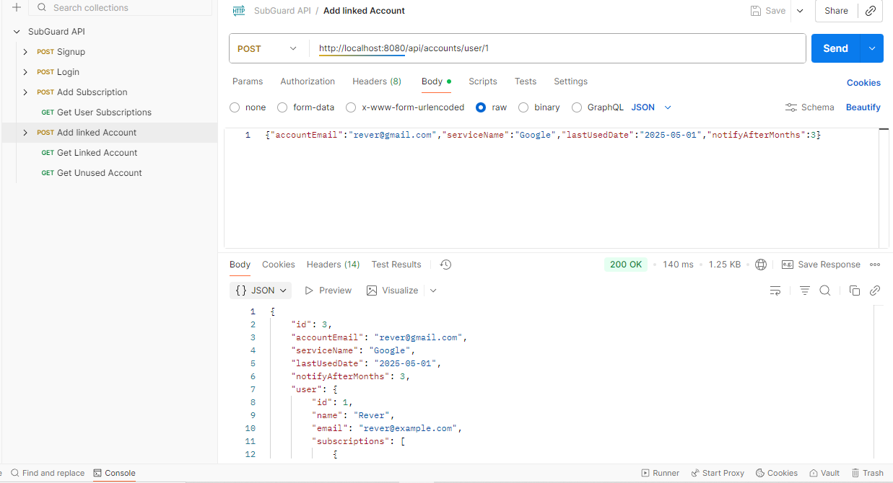

# SubGuard
**Smart Subscription & Privacy Manager**

SubGuard is a web-based application designed to help users **track subscriptions, save money, and manage digital privacy**, all from a single dashboard.

---

## Problem Statement
In today’s digital world:  

- Users often subscribe to multiple services (Netflix, Spotify, cloud apps) and forget renewals, leading to **unwanted charges**.  
- Managing personal accounts and digital data is **time-consuming and error-prone**.  
- Warranty and bill tracking for products is rarely organized.  

**SubGuard** aims to solve these challenges by providing a **simple, automated, and secure platform**.

---

## Key Features

- **Subscription Tracker**  
  - Track service name, cost, renewal date.  
  - Send reminders before auto-renewals or trial expiry.  
  - ✅ Completed (basic CRUD + reminders)  

- **Security & Authentication**  
  - User signup/login with Spring Security basic auth.  
  - ✅ Completed  

- **Linked Account Monitoring**  
  - Track linked accounts (Google, email, etc.).  
  - Notify user if accounts are unused for a configurable period.  
  - ✅ Completed  

### Future Enhancements 
- **Privacy Cleaner** → Identify unused accounts, suggest cleanup.  
- **Warranty & Bill Vault** → Store receipts, track warranty expiry.  
- **Smart Analytics** → Monitor spending, suggest alternatives.  

---

## Target Users
- Individuals with multiple digital subscriptions.  
- Users seeking better control of personal data and spending.  
- Anyone wanting a **simple, automated solution** for digital life management.  

---

## Why SubGuard is Unique
- Combines subscription tracking, privacy management, and warranty tracking in a **single platform**.  
- Focused on **ease-of-use and automation**, unlike scattered existing solutions.  
- **Scalable** to mobile apps, AI recommendations, and real-time notifications.  

---

## Proposed Technology Stack
- **Backend:** Java, Spring Boot  
- **Database:** MySQL / PostgreSQL  
- **Frontend:** React (Web App)  
- **Notifications:** Email / In-App Alerts  
- **Security:** Spring Security basic authentication  

---
## Backend Status 

The backend for SubGuard MVP has been implemented and tested using Postman.

### Tested Endpoints

**User Authentication**
- `POST /signup` → Register new user
- `POST /login` → User login

**Subscription Management**
- `POST /subscription` → Add new subscription
- `GET /subscriptions` → Retrieve all subscriptions

**Linked Account Management**
- `POST /linked-account` → Add a linked account
- `GET /linked-accounts` → Retrieve all linked accounts

## Running the Project Locally

### 1. Clone the repositoryclear

git clone https://github.com/Fuionic/SubGuard.git
cd SubGuard

### 2. Create MySQL database
CREATE DATABASE subguard;

### 3. Create a database user
CREATE USER 'your_username'@'localhost' IDENTIFIED BY 'your_password';
GRANT ALL PRIVILEGES ON subguard.* TO 'your_username'@'localhost';
FLUSH PRIVILEGES;

### 4. Configure environment variables (in IDE run configuration)
DB_USERNAME=your_username
DB_PASSWORD=you

### UI Screenshots
  
  
  

### Postman Testing Screenshots
  
  
  
  
  

